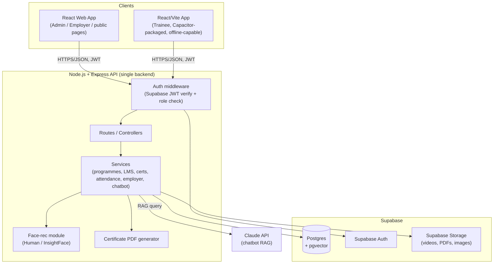

# Architecture

Status: **entirely proposed** — no code exists yet. Everything in this document is the intended design, not a description of an existing system. It will be revised as implementation reveals better answers; keep it in sync with reality once building starts rather than treating it as fixed.

## 1. Overview

Two client apps (React web, and a React/Vite mobile app packaged as a native Android app via Capacitor — see [DECISIONS.md](DECISIONS.md) #19) talk to a single Node/Express REST API, which is the only thing allowed to talk to Supabase. Supabase provides Postgres (with pgvector), Auth, and file Storage. The Claude API powers the RAG chatbot. Face recognition (attendance) and NFC profile reads run on dedicated external hardware (an ESP32-CAM and an NFC reader, respectively) wired into the **web** client, not into either app's own device hardware.

## 2. Architecture Diagram



## 3. Technology Stack

- Web: React + TypeScript
- Mobile: React + TypeScript (Vite), packaged as a native Android app via Capacitor — no camera/NFC device access needed (that hardware lives on the web side), so a WebView-wrapped web app covers the actual requirement; see [DECISIONS.md](DECISIONS.md) #19
- Backend: Node.js + Express + TypeScript
- Database: Supabase (Postgres, pgvector extension), Auth, Storage
- Face recognition: `@vladmandic/human` (default) or InsightFace `buffalo_l` via `onnxruntime-node` — see [DECISIONS.md](DECISIONS.md)
- Chatbot: Claude API, retrieval via pgvector
- Monorepo tooling: pnpm workspaces (proposed default; Turborepo/Nx not adopted unless build-time pain justifies it later)

## 4. Repository Structure

```
/apps
  /web         React (Vite) — admin dashboards, employer portal, public cert/profile pages
  /mobile      React (Vite) + Capacitor — trainee app: learning, offline download/sync
  /api         Node + Express — the one shared backend
/packages
  /shared-types  TS types for API request/response and DB rows
  /api-client    Typed functions wrapping calls to the Express API; used by both web and mobile
  /validation    zod schemas shared between Express request validation and client forms
  /constants     roles, enums, shared IDs
/docs
/prompts
```

## 5. Frontend Architecture

- **Web** (React): plain React. Suited to dashboard-dense admin/employer screens (tables, charts) and public no-login pages (certificate verify, profile).
- **Mobile** (React + Vite, Capacitor): trainee-only. Offline storage/downloads via Capacitor plugins (`@capacitor/filesystem`, a SQLite plugin — not yet installed, added when the offline-queue feature is actually built per [DECISIONS.md](DECISIONS.md) #19). No native camera or NFC access is needed — face-recognition attendance and NFC profile reads both run on external hardware (ESP32-CAM, NFC reader) wired into the web client, not the trainee's phone.
- Both import from `packages/api-client`, `packages/shared-types`, `packages/validation` — no duplicated fetch logic or type definitions between the two.
- Unlike the original design, UI components **can** now be shared or ported between web and mobile where it makes sense — `apps/mobile` is expected to reuse/adapt `apps/web/src/trainee/*`'s already-built screens rather than duplicate them from scratch, since both are the same React/Vite stack (see [DECISIONS.md](DECISIONS.md) #19). They remain genuinely separate apps (different audiences, different shells), not a single shared UI package — this is deliberate reuse where convenient, not a merge.

## 6. Backend Architecture

- Express layering: `routes` → `controllers` → `services` → Supabase client / external services.
- `services` is where face-recognition matching, PDF certificate generation, and chatbot RAG orchestration live — kept out of controllers to stay testable.
- Auth middleware verifies the Supabase JWT and enforces role checks before a request reaches a controller (in addition to Postgres RLS — defense in depth, not a substitute for it).
- Face-recognition service: the browser extracts a **1024-d** descriptor with `@vladmandic/human` (DECISIONS.md #16 — note 1024 is Human's actual output size; InsightFace `buffalo_l`, the documented alternative, is 512-d, so the two are not schema-interchangeable), and Express compares it against the trainee's enrolled descriptor by cosine similarity, returning a match/no-match decision; the controller falls back to the QR flow when below threshold.

## 7. Database Architecture

See [docs/DATABASE.md](DATABASE.md) for the entity-level data model. Summary: one Supabase Postgres instance, shared by web and mobile through the Express API — no client ever queries Supabase directly.

## 8. API Architecture

- REST over HTTPS, JSON payloads, JWT bearer auth.
- Single versionless API for now (`/api/...`); versioning strategy is `TBD` — decide before the first breaking change, not preemptively.
- `docs/API.md` is intentionally not created yet — write it once the first real routes exist, generated from what's actually built, not speculated in advance.
- File uploads (videos, images, resumes) go through Express to Supabase Storage — clients never get direct Storage write access.

## 9. Authentication / Authorization

- Supabase Auth issues JWTs (email/OTP/phone — exact methods `TBD`).
- Web uses `localStorage` session persistence via `@supabase/supabase-js`; mobile uses an `AsyncStorage` adapter — same underlying Auth logic, platform-specific storage only.
- Roles (Admin, Trainer, Trainee, Employer) stored on a `profiles` table; enforced both by Postgres RLS policies and by Express middleware role checks.

## 10. External Services

- **Supabase** — Auth, Postgres/pgvector, Storage.
- **Claude API** — chatbot response generation over retrieved context.
- **Face-recognition model** — runs in-process in Express (Node), not a separate hosted service, to avoid extra infra for MVP.
- **Push notifications** — provider `TBD` (FCM/APNs).

## 11. Key Data Flows

- **Enrollment → Certification → Verification**: see PRD §8. Certificate PDF + QR generated server-side on assessment pass; verification page hits an open (no-auth) Express endpoint keyed by certificate ID.
- **Attendance (face)**: mobile captures photo → POST to Express → embedding extracted → pgvector similarity search against enrolled embeddings → threshold match → attendance logged; below threshold → client falls back to QR.
- **Offline sync**: mobile queues writes (progress, quiz results, attendance) locally while offline → on reconnect, replays them against the _same_ Express endpoints used when online (no separate sync API) → last-write-wins by timestamp on conflict.
- **Chatbot**: user query embedded → pgvector similarity search over course/FAQ corpus → top matches + query sent to Claude API → response returned.

## 12. Error Handling

Conventions (status codes, error payload shape, client-side retry policy) are `TBD` — to be established with the first Express routes and then documented here, not invented speculatively.

## 13. Security

- RLS on all Postgres tables; Express role middleware as a second layer.
- Biometric (face embedding) storage requires recorded consent (DPDP Act 2023) — no embedding stored without a `consent_given_at` timestamp.
- Server-side recomputation of anything security-relevant (quiz scores, face match, certificate validity) — never trust client-reported values.
- Secrets via environment variables, never committed; `.env.example` documents required vars.

## 14. Performance & Scalability

MVP is prototype-scale; no concurrent-user or data-volume targets have been set (`TBD`). Revisit once real usage patterns exist — do not pre-optimize (e.g., no need for read replicas, caching layers, or CDN video delivery at MVP stage) unless a specific bottleneck is observed.

## 15. Deployment Architecture

`TBD` in full — no hosting provider chosen for web, API, or mobile builds; no CI/CD pipeline exists yet. Supabase itself is hosted (managed service) regardless of where the rest deploys.

## 16. Technical Risks & Constraints

- **Offline sync** is the most complex module in the MVP — budget real engineering time; scoped deliberately to last-write-wins, not a full CRDT engine (see DECISIONS.md).
- **Face recognition reliability in live/demo conditions** (lighting, camera quality) — QR fallback exists specifically to de-risk this.
- **No DRM on downloaded video** — accepted limitation for MVP, not solved.
- **NFC platform fragmentation** (Web NFC is Chrome-Android-only; iOS write restrictions) — avoided by scoping to a static pre-written NDEF URI tag rather than in-app read/write (see DECISIONS.md).
- **Government scheme and skill-taxonomy data** (Phase-2 dependencies) require an external data-maintenance commitment, not just code — flagged in PRD Open Questions.
